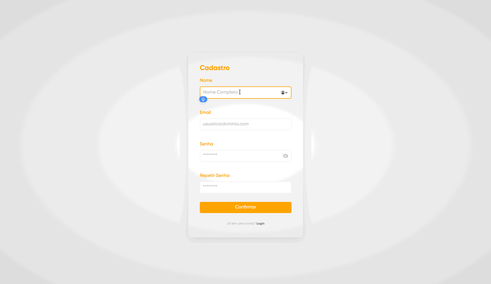

#### Projeto de site desenvolvido visando integrar as matérias de Desenvolvimento Front/Back-end e Banco de Dados

# Instalações necessárias

```diff
python -m venv venv
```

```diff
source venv/bin/activate
```

```diff
python -m pip install Django
```

```diff
pip install deep-translator
```

```diff
python manage.py makemigrations website
```

```diff
python manage.py migrate
```

# WebPage em funcionamento

<div align="center" >
  <h3>Página de Login</h3>
  
  <h3>Página de Cadastro</h3>
  
  <h3>Página Principal</h3>
  
  <h3>Logout e Página de Perfil</h3>
  
</div>
